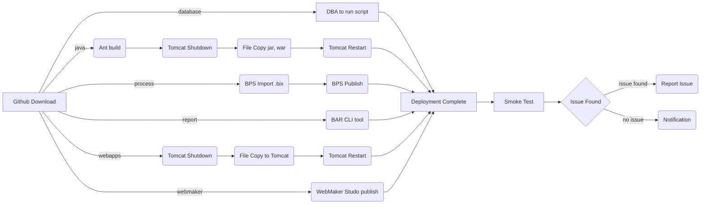

# HHS CDC BizFlow HR Workflow System

## Welcome to CDC BizFlow project repository

Update History:
> ***Created by Taeho on March 20, 2018*** - a place holder document to create a repository. 
> ***Updated by Taeho on April 2, 2018*** - adding system components, build instruction, setup local development environment.

----------

### 1. System Components

This repository includes directories below.

| Directory | Description |
|-----------|-------------------------------|
|database   | `Database scripts; DDL, Permission, Stored Procedure, Functions, and Populating records in HHS_CDC_HR, HHS_HR, Workflow database` |
|java       | `Custom-developed Java module` |
|process    | `Process definition, user group, BizCove/View/Menu` |
|release    | `snapshot of released version` |
|report     | `Report export ` |
|webapps    | `Web application, including BizFlow web solution, WebMaker runtime directory` |
|webmaker   | `WebMaker export files` |

----------

### 2. Build Instruction

#### Pre-requisite
 - JDK 1.7 
 - Apache Ant 1.9.x
 - Git
 - Github account
 
> **Notes:** As of April 2nd 2018, the official **JDK**  is not 1.8.x but **1.7.x**. All HHS HR workflow (EWITS 2.0) applications will be deployed to a shared environment having 1.7.x 64bit. **Ant** will be official build tool across all HHS HR workflow applications. If you are using **Maven** or **Gradle** to build your code, you must create an Ant build script too.

#### Build Steps

> Source Repository: *https://github.com/HHS/CDC-BizFlow*

